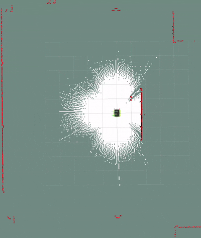

# Jackal Setup Guide

This repository contains the launch files required to run Nav2 onboard a Clearpath Jackal. These launch and configuration files have only been tested with **ROS2 Humble**

## Repository Structure
```text
Onboard-Jackal/
├── maps/                   # Saved maps
└── real_jackal/
    ├── config/             # Config files for navigation and localization
    └── launch/             # Launch files for SLAM & Nav2
```

---

## Initial Setup

### Ethernet Setup (Laptop)
1. On your laptop, **Settings > Network > Wired**.
2. Click the plus (**+**) icon at the top to create a new profile.
3. Go to the **IPv4** tab and select **Manual**.
4. Fill in the fields as shown below:

| Setting | Value |
| :--- | :--- |
| **Address** | `192.168.131.101` |
| **Netmask** | `255.255.255.0` |
5. Click **Add** and choose that profile

### Connecting to the Jackal
- Turn the Jackal on
- Connect an ethernet cable from the Jackal to your laptop
  - Ensure the profile is chosen in your wired settings
- Open a terminal on your laptop and verify the connection:
```bash
ping 192.168.131.1
```
- If successful, SSH into the Jackal:
```bash
ssh administrator@192.168.131.1
```
### Workspace Setup (Onboard Jackal)
Once connected via SSH, clone and build the repository:
```bash
git clone https://github.com/nahl-f/Onboard-Jackal
cd Onboard-Jackal
colcon build
source install/setup.bash
```
> **Note:** Ensure you have the Docker container set up on your laptop before proceeding. Please refer to the [Offboard Repository Instructions](https://github.com/nahl-f/Jackal-Person-Nav) for laptop environment setup.

---

## Mapping

### Step 1: Launch SLAM (Onboard Jackal)
Launch SLAM to begin generating a map.
```bash
cd ~/Onboard-Jackal
source install/setup.bash
ros2 launch jackal_nav slam.launch.py
```
### Step 2: Visualize Map (Laptop)
Open a terminal **inside the laptop's Docker container** to view the mapping process:
```bash
cd /workspaces/ros_ws/scripts
source ros_ethernet.env
ros2 launch clearpath_viz view_navigation.launch.py namespace:=jackal1
```

### Step 3: Save the Map (Laptop)
Once mapping is complete, open a **new terminal** on the laptop (inside the Docker container) and source the ethernet script to save the map. This will save a **map.pgm** and **map.yaml** in your current directory.
```bash
ros2 run nav2_map_server map_saver_cli -f <map_name> --ros-args -r map:=/jackal1/map
```
---

## Navigation

### Step 1: Launch Navigation Stack (Onboard Jackal)
Open **two SSH terminals** into the Jackal.

**Terminal 1:** Launch localization with your saved map.
```bash
cd ~/Onboard-Jackal
source install/setup.bash
ros2 launch jackal_nav localisation.launch.py map:=<path_to_map>
```
Provide an **initial pose estimate** using RViz. Change the laser topic to /jackal1/sensors/lidar3d_0/scan using the dropdown menu if laser scans are not visible.

**Terminal 2:** Launch Nav2.
```bash
cd ~/Onboard-Jackal
source install/setup.bash
ros2 launch jackal_nav nav2.launch.py 
```
### Step 2: Visualize Navigation (Laptop)
Open a terminal **inside the laptop's Docker container**:
```bash
cd /workspaces/ros_ws/scripts
source ros_ethernet.env
ros2 launch clearpath_viz view_navigation.launch.py namespace:=jackal1
```
You can provide goals using **Nav2 Goal** in RViz.
